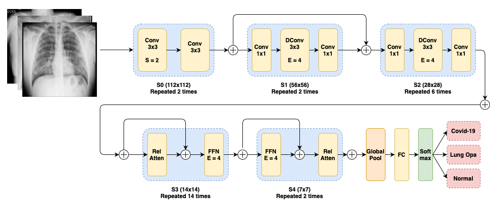

# Makan Farhoodi

<span style="color:blue">**<a href="mailto:mak.farhoodi@gmail.com">mak.farhoodi@gmail.com</a>
|
<a href="https://github.com/MakanFar" target="_blank">GitHub</a>
|
<a href="https://www.linkedin.com/in/makan-farhoodi-470120133/" target="_blank">LinkedIn</a>**</span>


## **Education**

`Current` **University of California, Davis**

: Ph.D. Computer Science
: Advisor: C. Titus Brown

**Istanbul Aydin University, Istanbul Turkey**

: B.E. Software Engineering
: Advisor: Prof. Dr. ALİ OKATAN

**United World College-USA, New Mexico, USA**

: International Baccalaureate, IB


## **Employment**

`2022- Current` **Graduate Research Assistant**

&nbsp; &nbsp; &nbsp; _University of California-Davis_

: >  Applied AI/ML in healthcare and genomics.


`2022- Current` **Student Researcher**

&nbsp; &nbsp; &nbsp; _University of California-Davis_

: >  Medical imaging and applications of deep learning in medical image segmentation, detection, and classification.


`May 2022- Sep 2022` **Software Engineer**

&nbsp; &nbsp; &nbsp; _Dtech Software (Istanbul, Turkey)_

: > Developed customer communication management (CCM) systems using technologies such as Quadient, TypeScript, SQL, SoapUI and .Net.


`May 2020- Apr 2021` **Software Engineer Contractor**

&nbsp; &nbsp; &nbsp; _Vista Medikal (Istanbul, Turkey)_


: > Full-stack development using JS, React and Nodejs.


`Jul 2020- Oct 2020` **Software Engineering Intern**

&nbsp; &nbsp; &nbsp; _Entekhab Group (Tehran, Iran)_

: > Worked on embedded systems with IoT applications using MCU, C, and C# programming.


## **Projects & Leadership**


`Aug 2022` **Deep Learning for early diagnosis of Covid-19 infection based on CXRs.**

&nbsp; &nbsp; &nbsp; (In Submission) Advisor: Prof. Dr. ALİ OKATAN

: > A novel depth-wise convolution neural networks model with self-attention layers for diagnosis Covid-19, lung opacity, normal using chest X-rays.

<!-- image -->
<p align="center"></p>


`2021-2022` **Autonomous vehicle**

&nbsp; &nbsp; &nbsp; AI / Computer Vision

: > Developed a self-driving vehicle prototype that won a prize at Teknofest competition in Turkey.

`2021-2022` **Covid-19 monitoring with AI enabled camera**

&nbsp; &nbsp; &nbsp; AI / Computer Vision

: > Developed a social distancing and face mask detection system using object detection, and Convolution Neural Network (CNN).

---------------------------------------------------------------------------------

## **HONORS**

`Sep 2022` **Fellowship Award, University of California-Davis**

`2018` **IAU academic scholarship, Istanbul Aydin University**

`2015` **Horizon Foundation full scholarship, United World College-USA**


## **Skills**

```python
< ML > 

PyTorch, scikit-learn, Keras, Caffe, TensorFlow, numPy, Pandas, Matplotlib, spaCy
-------------

< Web Dev >

React, Redux, AJAX, NodeJS, Django, Flask, Laravel, SQL, MySQl
-------------

< Data Science >

R, R Shiny, Snakemake, Apache Spark, Tableau, AWS
-------------

 < Programming >
 
 Python, JS, C, C++, "C#", .Net, Java, Dart, Rust
```
## **Certificates**

`Dec 2021`[Structuring Machine Learning Projects by Andrew Ng](https://www.coursera.org/account/accomplishments/verify/F2CACVRGW3GA?utm_source=link&utm_medium=certificate&utm_content=cert_image&utm_campaign=sharing_cta&utm_product=course)

`Dec 2021`[Improving Deep Neural Networks: Hyperparameter Tuning by Andrew Ng](https://www.google.com/url?sa=D&q=https://coursera.org/share/950fa2bf7c35381d7d02107e825989d0&ust=1665343980000000&usg=AOvVaw3FTohU3yWWr27JqcStFYju&hl=en)

`Oct 2021`[Neural Networks and Deep Learning by Andrew NG](https://www.google.com/url?sa=D&q=https://coursera.org/share/62b824a53175fceae44e4e50ca5207ff&ust=1665343980000000&usg=AOvVaw19A2FZQjZrLN6QEMM0kLov&hl=en)

