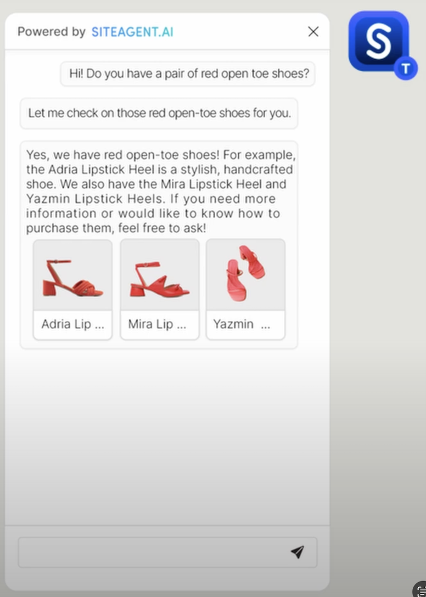
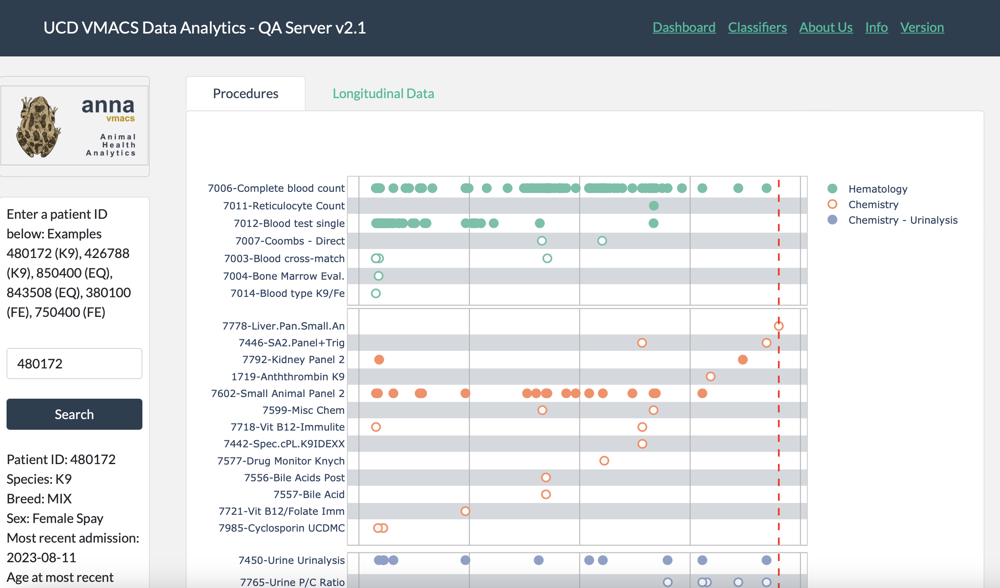
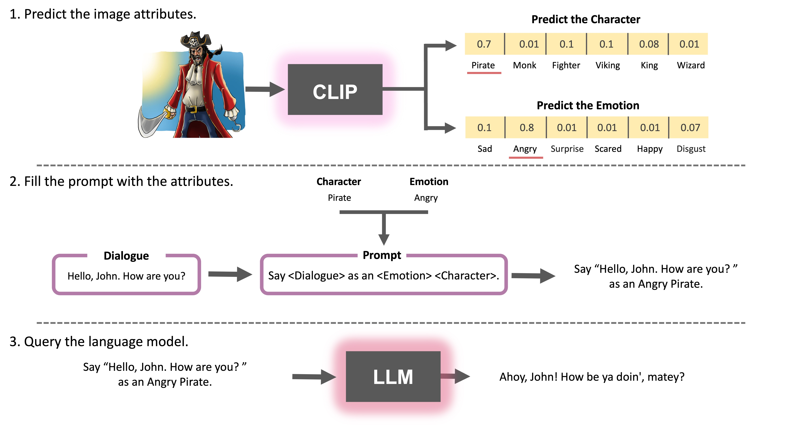

# Makan Farhoodi

<span style="color:blue">**<a href="mailto:mfarhoodi@ucdavis.edu">mfarhoodi@ucdavis.edu</a>
|
<a href="https://github.com/MakanFar" target="_blank">GitHub</a>
|
<a href="https://www.linkedin.com/in/makan-farhoodi-470120133/" target="_blank">LinkedIn</a>**</span>


## **Education**

`Current` **University of California, Davis**

: Ph.D. Computer Science
: Advisor: C. Titus Brown

**University of California, Davis**

: Masters in Computer Science


**Istanbul Aydin University, Istanbul Turkey**

: B.E. Software Engineering

**United World College-USA, New Mexico, USA**

: International Baccalaureate, IB


## **Employment**

`2022- Current` **Graduate Research Assistant**

&nbsp; &nbsp; &nbsp; _University of California-Davis_

: >   AI-driven diagnostic frameworks integrated with EHR and clinical systems

`Jun 2024- Sep 2024` **Software Engineer**

&nbsp; &nbsp; &nbsp; _Active Prime (Mountain View, CA)_

`Jun 2024- Sep 2024` **Software Engineer**

&nbsp; &nbsp; &nbsp; _Clipo Labs (Mountain View, CA)_
`Jun 2023- Sep 2023` **Product Manager**

&nbsp; &nbsp; &nbsp; _UC Davis School of Veterinary Medicine_
`May 2023- Sep 2023` **AI/APP Developer**


## **Projects**


`2024` **SiteAgent AI - AI customer service**

: >  AI-powered assistant that integrates seamlessly with online stores, understands product catalogs, and enables customers to navigate websites, receive support, and get smart product recommendations through multilingual voice and text interactions in over 80 languages. [Website](https://siteagent.ai)

<!-- image -->
<p align="center"></p>

`Sep 2023` **ANNA - Animal Health Analytics Dashboard**

: >  Real-time clinical diagnosis dashboard incorporating AI to enhance clinical decision-making confidence. (Python, Flask, Dash) [Article](https://www.vetmed.ucdavis.edu/news/uc-davis-researchers-exploring-data-and-ai-tools-animal-health-diagnosis-and-treatment)

<!-- image -->
<p align="center"></p>


`Mar 2023` **Dialogue Style Transfer.**

: >  An multimodal workflow and app that combines Zero-shot large models with Zero-shot image-to-text models, enabling users to customize dialogues based on a specified character and their characteristics. [Github](https://github.com/MakanFar/StyleMyDialogue)

<!-- image -->
<p align="center"></p>

---------------------------------------------------------------------------------

## **Papers**

`2024` Farhoodimoghadam, M., Zwingenberger, A. (2024). Diagnosis and classification of portosystemic shunts: a machine learning retrospective case-control study.
[DOI](https://doi.org/10.3389/fvets.2024.1291318)

`2024` Kong, C.,Farhoodimoghadam, M. Enhancing AI Accessibility in Veterinary Medicine: Linking Classifiers and Electronic Health Records 
[DOI](https://doi.org/10.48550/arXiv.2410.14625)


## **Skills**

```python
< ML > 

PyTorch, LangChain, scikit-learn, Keras, Caffe, TensorFlow, numPy, Pandas, Matplotlib, spaCy
-------------

< Web Dev >

React, Redux, AJAX, NodeJS, Django, Flask, Laravel, SQL, MySQl
-------------

< Data Science >

R, R Shiny, Dash, Apache Spark, AWS
-------------

 < Programming >
 
 Python, JS, PhP, C++, "C#", Java, Rust
```
## **Certificates**

`Dec 2021`[Structuring Machine Learning Projects by Andrew Ng](https://www.coursera.org/account/accomplishments/verify/F2CACVRGW3GA?utm_source=link&utm_medium=certificate&utm_content=cert_image&utm_campaign=sharing_cta&utm_product=course)

`Dec 2021`[Improving Deep Neural Networks: Hyperparameter Tuning by Andrew Ng](https://www.google.com/url?sa=D&q=https://coursera.org/share/950fa2bf7c35381d7d02107e825989d0&ust=1665343980000000&usg=AOvVaw3FTohU3yWWr27JqcStFYju&hl=en)

`Oct 2021`[Neural Networks and Deep Learning by Andrew NG](https://www.google.com/url?sa=D&q=https://coursera.org/share/62b824a53175fceae44e4e50ca5207ff&ust=1665343980000000&usg=AOvVaw19A2FZQjZrLN6QEMM0kLov&hl=en)

